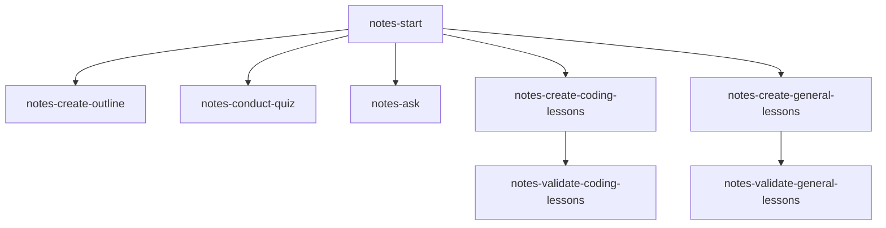

# notes-skills

My collection of skills for learning and note-taking with AI agents



### Skills

- **[`notes-start`](./notes-start/)**: This skill orchestrates the learning flow, runs the initial grill (capturing topic, scope, and quiz delivery preferences), initializes `agent_notes.md` for context-less agent handoffs, and coordinates all sub-skills.
- **[`notes-create-outline`](./notes-create-outline/)**: This skill generates root `agent_notes.md` (settings, preferences, struggle tracker) and true DAG `overview.md` roadmaps. Modules contain `overview.md` and `questions.md` (no module `notes.md`).
- **[`notes-conduct-quiz`](./notes-conduct-quiz/)**: This skill conducts diagnostics, check-in quizzes, and reviews via the built-in question tool (`ask_question`) or token-saving Markdown checkboxes (`- [ ]`), logging struggle points to `agent_notes.md`.
- **[`notes-ask`](./notes-ask/)**: This skill answers mid-lesson questions, generates Mermaid diagrams, logs Q&As to `questions.md`, and notes learner friction in `agent_notes.md`.
- **[`notes-create-coding-lessons`](./notes-create-coding-lessons/)**: This skill generates coding lessons with runnable examples and explanations.
- **[`notes-create-general-lessons`](./notes-create-general-lessons/)**: This skill generates lessons for non-coding and practical craft topics.
- **[`notes-validate-coding-lessons`](./notes-validate-coding-lessons/)**: This skill checks coding lessons for syntax errors and API accuracy.
- **[`notes-validate-general-lessons`](./notes-validate-general-lessons/)**: This skill checks non-coding lessons for factual accuracy and realism.

## Installation & Management

Run the interactive CLI using `npx`:

```bash
npx --allow-git=all github:asquilatan/notes-skills
```

*(Note: npm 11+ disables git packages by default. Run `npm config set allow-git all` once to use plain `npx github:...` without the flag).*

It will ask whether you want to **install** or **remove** skills, and whether to target your current repo (`.agents/skills`) or globally (`~/.agents/skills`).

You can also use flags directly:

```bash
# Install
npx github:asquilatan/notes-skills --repo      # Local repo
npx github:asquilatan/notes-skills --global    # Global

# Remove
npx github:asquilatan/notes-skills --remove --repo
npx github:asquilatan/notes-skills --remove --global
```

### Usage

Start a topic by running:

```text
/notes-start [topic]
```

or simply:

```text
Teach me [topic]
```

### Flow

1. **Initial Grill**: The agent asks questions one at a time to establish your goals, target scope (deep dive vs. breadth), and preferred question delivery format (built-in question tool vs. token-saving `- [ ]` markdown checkboxes). It saves these settings to root `agent_notes.md` so any new agent can pick up your exact preferences without prior context.
2. **Diagnostic Quiz**: It runs a quick adaptive diagnostic to determine your baseline knowledge frontier.
3. **Curriculum Outline**: It generates `overview.md` with a true DAG dependency graph and sets up module directories (`overview.md` + `questions.md`; no module `notes.md`).
4. **Lesson Generation & Validation**: It drafts lessons with runnable code or craft protocols, audits them for accuracy, and logs verification status to `agent_notes.md`.
5. **Check-ins & Progression**: You read each lesson and take check-ins via your preferred mode (built-in question tool or checking `- [x]` in `questions.md`). Any missed questions activate Hydra drills and log struggle points in `agent_notes.md` to ensure mastery before advancing.
