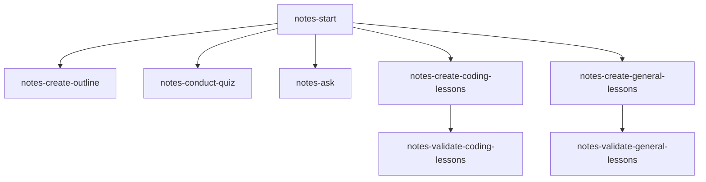

# notes-skills

My collection of skills for learning and note-taking with AI agents



### Skills

- **[`notes-start`](./notes-start/)**: This skill orchestrates the learning flow, runs the diagnostic questions, and coordinates the other skills.
- **[`notes-create-outline`](./notes-create-outline/)**: This skill generates and updates outlines (`notes.md` and `overview.md`) with Mermaid diagrams and progress tracking.
- **[`notes-conduct-quiz`](./notes-conduct-quiz/)**: This skill conducts diagnostics, check-in quizzes, and review questions.
- **[`notes-ask`](./notes-ask/)**: This skill answers mid-lesson questions and logs them to `questions.md`.
- **[`notes-create-coding-lessons`](./notes-create-coding-lessons/)**: This skill generates coding lessons with runnable examples and explanations.
- **[`notes-create-general-lessons`](./notes-create-general-lessons/)**: This skill generates lessons for non-coding and practical craft topics.
- **[`notes-validate-coding-lessons`](./notes-validate-coding-lessons/)**: This skill checks coding lessons for syntax errors and API accuracy.
- **[`notes-validate-general-lessons`](./notes-validate-general-lessons/)**: This skill checks non-coding lessons for factual accuracy and realism.

## Installation

Run the interactive installer using `npx`:

```bash
npx github:asquilatan/notes-skills
```

It will ask whether you want to install the skills in your current repo (`.agents/skills`) or globally (`~/.agents/skills`).

### Usage

Start a topic by running:

```text
/notes-start [topic]
```

or simply:

```text
Teach me [topic]
```

### Flow

1. **Initial Grill**: The agent asks a few questions one at a time to pin down your background, goals, and preferred depth.
2. **Diagnostic Quiz**: It runs a quick diagnostic to check your baseline knowledge so you skip what you already know.
3. **Curriculum Outline**: It generates `overview.md` with a visual dependency graph and `notes.md` for reference summaries.
4. **Lesson Generation & Validation**: It writes lessons with runnable examples, audits them for accuracy, and presents them for reading.
5. **Check-ins & Progression**: You read the lesson, take a quick check-in quiz, and advance through the roadmap.
