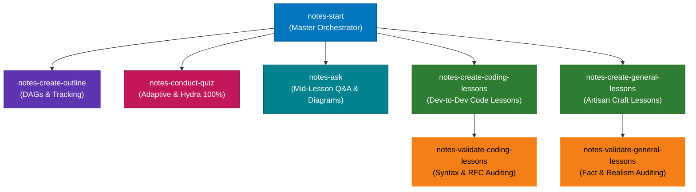

# Notes Learning Orchestration Skills

A modular suite of specialized skills for AI coding assistants and autonomous agents (such as Google Antigravity / Gemini CLI) to orchestrate rigorous, interactive, and deeply personalized technical courses.

---

## 🌟 Architecture & Skills Ecosystem

The system operates via a master orchestrator (`notes-start`) that delegates specialized pedagogy, curriculum modeling, content authoring, and assessment tasks across 7 sub-skills:



| Skill | Role & Responsibility |
| :--- | :--- |
| **[`notes-start`](./notes-start/)** | **Master Orchestrator**. Runs the initial grill, initiates diagnostics, prompts post-diagnostic length calibration, delegates lesson generation to dual subagents, and manages course advancement. |
| **[`notes-create-outline`](./notes-create-outline/)** | **Curriculum & DAG Architect**. Generates and maintains `notes.md` (curated summaries) and `overview.md` (branching Mermaid DAGs, numbered descriptive breakdowns, and position tracking). |
| **[`notes-conduct-quiz`](./notes-conduct-quiz/)** | **Interactive Assessment Engine**. Conducts 6–8 question two-phase adaptive diagnostics, 6–10 question post-lesson check-ins with codeblocks, Hydra 100% mastery remediation drills, and capstone quizzes. |
| **[`notes-ask`](./notes-ask/)** | **Socratic Q&A Assistant**. Answers mid-lesson doubts in a punchy dev-to-dev voice with targeted Mermaid diagrams and logs them directly to `questions.md`. |
| **[`notes-create-coding-lessons`](./notes-create-coding-lessons/)** | **Software Lesson Author**. Generates sequenced lesson files (`01-...md` to `0n-...md`) with runnable code snippets, after-code translations, and zero unexplained jargon. |
| **[`notes-create-general-lessons`](./notes-create-general-lessons/)** | **Practical Craft Lesson Author**. Generates lessons for non-code topics (e.g. baking, concrete molding, perfumery, carpentry) with structured protocols, sensory verification checks, and broken-case recoveries. |
| **[`notes-validate-coding-lessons`](./notes-validate-coding-lessons/)** | **Code & Spec Auditor**. Validates syntax, API versions, runtime semantics, and RFC standards prior to student study. |
| **[`notes-validate-general-lessons`](./notes-validate-general-lessons/)** | **Craft & Fact Auditor**. Audits physical mechanisms, scientific claims, and craft realism without micromanaging numbers. |

---

## 📐 Core Pedagogical & Architectural Principles

### 1. True DAG Dependency Graphs (Banning Linked Lists & Starbursts)
* **No Sequential "Linked Lists"**: Linear chains (`A → B → C → D`) are strictly prohibited unless every single step has an inescapable, direct prerequisite dependency.
* **No Artificial "Starbursts"**: Graphs cannot simply fan out into disconnected leaves that all blindly merge at the end without intermediate interaction.
* **Semantic Pathways**: Foundational concepts branch into parallel specialized concerns (e.g., Side Effects vs. Component Architecture) and converge naturally at application features (e.g., Data Fetching, Routing, Server Actions).

### 2. Strict 6–8 Question Two-Phase Diagnostic
* Pure binary search terminates in 3–4 questions, which is too brittle for learning (one lucky guess skews the baseline).
* **Phase 1 (Q1–Q4)**: Rapid binary search jumps to locate the candidate frontier (Option D is ALWAYS `"I'm not sure"`).
* **Phase 2 (Q5–Q8)**: Frontier confirmation (corroborating probes from practical/code angles) and boundary verification to guarantee a rock-solid starting point.

### 3. Post-Diagnostic Length Calibration
* Once the diagnostic reveals what the student already knows, the user is prompted to choose their course length:
  - **Short (1–3 modules)**: Quick sprint covering immediate foundations and essentials.
  - **Average (4–8 modules)**: Standard comprehensive curriculum (Recommended).
  - **Long (9+ modules)**: Deep, exhaustive masterclass covering low-level internals, edge cases, and scale.
* Module counts are **unforced and natural** (never padded with fluff to hit arbitrary round numbers).

### 4. Source Material Authority (PPT / Syllabus Rule)
* If the user provides lecture slides, PPTs, or an existing curriculum doc, the agent adheres **100% strictly** to that structure without inventing arbitrary divisions.

### 5. File Architecture: Separation of Concerns
* **`notes.md`**: Strictly the **Curated Executive Summary / Technical Reference** (`Why` → `Topic` → `Diagram` → `Summary`...). **Zero quiz clutter**.
* **`questions.md`**: The single hub for all student mid-lesson Q&As, diagnostics, check-ins, and Hydra remediation drills.
* **`overview.md`**: Course or module roadmap with a live Mermaid DAG showing current status (`:::done`, `:::current`, `:::pending`).
* **Lesson files (`01-...md`)**: Pure, uninterrupted reading material with zero trailing quiz sections.

### 6. Hydra 100% Mastery Protocol
* A lesson check-in is passed **only upon achieving 100% accuracy**.
* For **every 1 missed question**, the Hydra activates, spawning **2 new targeted drill questions** on that specific misconception until 100% mastery is achieved.

---

## 🚀 Installation & Usage

### Option 1: Global Installation for Antigravity / Gemini CLI
Copy or symlink the skill folders into your global skills directory:

**Windows (PowerShell)**:
```powershell
Copy-Item -Path ".\notes-*" -Destination "$HOME\.agents\skills\" -Recurse -Force
# Or for Gemini CLI:
Copy-Item -Path ".\notes-*" -Destination "$HOME\.gemini\config\skills\" -Recurse -Force
```

**Linux / macOS**:
```bash
cp -r ./notes-* ~/.agents/skills/
# Or for Gemini CLI:
cp -r ./notes-* ~/.gemini/config/skills/
```

### Option 2: Project-Local Installation
Copy the skills directly into your workspace's `.agent/skills/` directory:
```powershell
Copy-Item -Path ".\notes-*" -Destination ".\my-project\.agent\skills\" -Recurse -Force
```

### Triggering a Course
In your agent session, simply run:
```
Teach me [Topic]
```
or invoke:
```
/learn [Topic]
```
The master orchestrator (`notes-start`) will take over and guide you through the grilling, diagnostic, and course generation.
