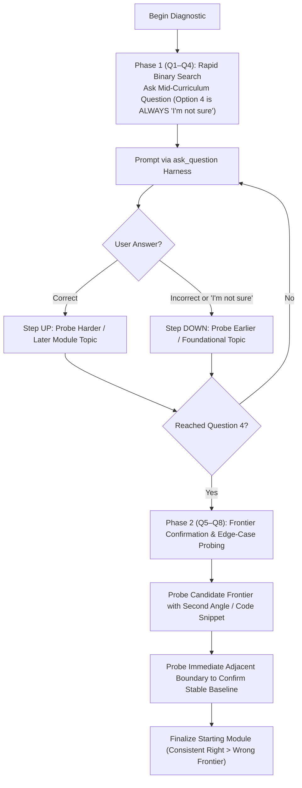
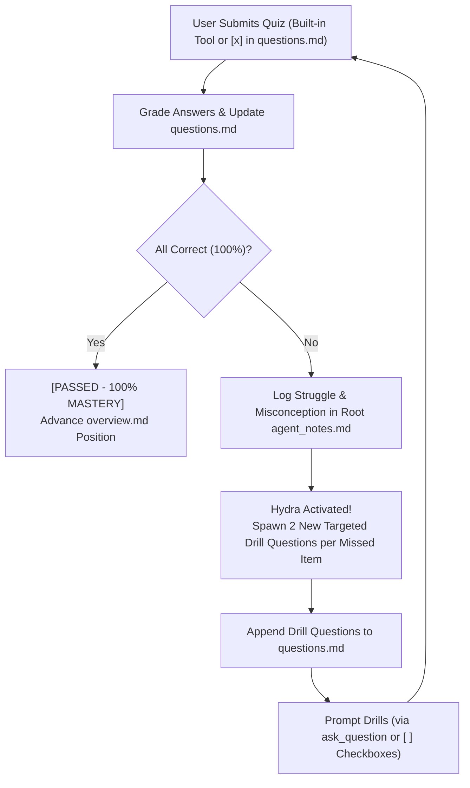

# Notes Conduct Quiz

Use this skill to conduct all learning assessments. All quizzes are written to the target `questions.md` file (root or module level), delivered either via the built-in question tool (`ask_question`) or token-saving Markdown checkboxes (`- [ ]`), and learner struggle areas are actively logged to root `agent_notes.md` for context-less agent handoffs.

> [!CAUTION]
> **WORKSPACE PATH ENFORCEMENT (CRITICAL)**:
> All `questions.md` and `agent_notes.md` files MUST be created and edited inside the user's **active project workspace (Current Working Directory)** (e.g., `./notes/` or `./01-.../`).
> **NEVER** write or edit files inside `~/.agents/`, `~/.gemini/`, or inside the skill's own installation path.
> **NEVER** write quiz items to module folders as `notes.md` (modules do not use `notes.md`).

---

## 1. The 5 Quiz Types & Sizing

Quizzes are delivered using the learner's preferred mode recorded in root `agent_notes.md` (**Built-in Question Tool** or **Markdown Checkbox Mode**).

| Quiz Type | Location | Purpose & Trigger | Sizing & Strategy | Delivery Format |
| :--- | :--- | :--- | :--- | :--- |
| **Course Diagnostic** | Root `notes/questions.md` | Calibrates starting point across the whole course roadmap before outlining. | **Adaptive Binary Search with Confirmation (6–8 Questions)**: Starts at moderate difficulty. If correct -> harder/later topic; if wrong / "not sure" -> earlier topic. Confirms frontier to eliminate lucky guesses. | Written to root `questions.md`. Delivered via chosen format (Built-in Tool or Checkbox). Frontier logged to `agent_notes.md`. |
| **Module Diagnostic** | `NN-module/questions.md` | Calibrates baseline familiarity within the specific module before lesson authoring. | **Adaptive Binary Search with Confirmation (6–8 Questions)**: Probes prerequisites and core module concepts, confirming baseline with 6–8 total questions. | Written to module `questions.md`. Delivered via chosen format. Baseline logged to `agent_notes.md`. |
| **Post-Lesson Check-in** | `NN-module/questions.md` | Validates understanding of a single lesson when the user signals "ready". | **6–10 Questions**: Includes dedicated application codeblocks, tradeoff analysis, and common bugs. | Written to `questions.md` with syntax-highlighted codeblocks. Delivered via chosen format. |
| **Hydra Remediation Drill** | `NN-module/questions.md` | Triggered if any check-in question is missed. Enforces **100% mastery**. | **2 new targeted drill questions per missed item**. | Appended to `questions.md`. Delivered via chosen format until 100%. Struggles logged to `agent_notes.md`. |
| **Module Re-quiz** | `NN-module/questions.md` | Comprehensive retention and synthesis test across all lessons in the module. | **~20 Fresh Questions**: Brand new scenarios testing integration across the entire module. | Written to `questions.md` & delivered in chunks (Built-in Tool or Checkbox). |
| **Course Major Quiz** | Root `notes/questions.md` | Comprehensive capstone evaluation covering all modules in the course. | **35–65 Questions** (Scaled to size: ~35 for 5-lesson courses, up to ~65 for 15+ lesson courses). Fresh real-world problems. | Written to root `questions.md` & chunked via chosen format. Final mastery summary logged to `agent_notes.md`. |

---

## 2. Adaptive Binary Search Diagnostic Algorithm & "I'm Not Sure" Rule

> [!IMPORTANT]
> **MANDATORY 4TH OPTION ON DIAGNOSTIC TESTS**:
> In all diagnostic quizzes (both Course Diagnostic and Module Diagnostic), **Option 4 (Option D) MUST ALWAYS be `"I'm not sure"`**.
> Never force the student to guess. Selecting `"I'm not sure"` signals an honest knowledge boundary and instructs the binary search to step down to earlier/foundational topics.

> [!IMPORTANT]
> **UNIFORM ANSWER DISTRIBUTION ON DIAGNOSTICS (33.3% SPLIT ACROSS A, B, C)**:
> Since Option D is reserved for `"I'm not sure"`, the correct answer MUST be evenly distributed across Options A, B, and C with ~33.3% probability each. **NEVER bias diagnostic questions toward Option A**.

> [!IMPORTANT]
> **STRICT SIZING: 6 TO 8 QUESTIONS (NEVER TERMINATE AT 3–4)**:
> Pure mathematical binary search can terminate in 3–4 steps, but that is too brittle for learning (one lucky guess skews the baseline). 
> **Every diagnostic test MUST deliver 6 to 8 questions total** using the two-phase protocol:



### The Two-Phase 6–8 Question Protocol

1. **Phase 1: Rapid Binary Search (Questions 1 to 4)**:
   - **Q1 (Midpoint)**: Select a representative, moderate-difficulty question from the middle of the curriculum.
   - **Q2 to Q4 (Adaptive Jumps)**:
     - **If Correct**: Step forward to advanced concepts or later module topics to check reach.
     - **If Incorrect or "I'm not sure"**: Step backward to foundational concepts or earlier module topics.
   - By Question 4, you have identified a *candidate frontier*. **DO NOT STOP HERE.**
2. **Phase 2: Frontier Confirmation & Cross-Verification (Questions 5 to 8)**:
   - **Q5 & Q6 (Corroborating Probes)**: Probe the candidate frontier again from a different perspective (e.g. practical code inspection or failure-case analysis instead of pure recall) to rule out lucky guesses.
   - **Q7 & Q8 (Boundary Verification)**: Test the immediate boundary below or above the frontier to ensure the foundational baseline is truly rock-solid and the identified starting point is precise.
3. **Outcome (Calibrated Starting Point)**:
   - Once all 6 to 8 questions are evaluated, identify the exact boundary where the student consistently gets questions right more times than wrong.
   - That verified frontier becomes the calibrated starting module.

---

---

## 3. Question Delivery Modes: Built-in Question Tool vs. Markdown Checkboxes

Quizzes can be delivered in one of two modes based on the learner preference set during initial grilling and recorded in root `agent_notes.md`:

### Mode A: Built-in Question Tool (`ask_question`)
1. **Write Questions to `questions.md`**: Format questions with full syntax-highlighted codeblocks and clear options.
2. **Deliver via `ask_question`**: Prompt questions in chunks of 3–5 using the built-in question tool so the user selects their choices.
3. **Instant Evaluation**: Grade user answers, record results (`[CORRECT]` / `[INCORRECT]`), and append explanations directly in `questions.md` and in chat using markdown blockquotes (`> `) for indented, colored separation:
   ```markdown
   > **Evaluation**: `[CORRECT]` (or `[INCORRECT]`)
   > - **Your Answer**: B
   > - **Correct Answer**: B) [Correct Option Text]
   > - **Explanation**: [Clear conceptual explanation of why this option is correct and why other choices fail.]
   ```

### Mode B: Markdown Checkbox Mode (`- [ ]` in `questions.md`) (Token-Efficient)
*Why use this mode?* Eliminates token-heavy tool call payloads. The agent never duplicates questions inside `ask_question` tool arguments. Everything stays in the markdown file:
1. **Write Checkboxes to `questions.md`**:
   ````markdown
   ### Quiz: Lesson [NN] Check-in ([Lesson Title])
   *Conducted on: YYYY-MM-DD HH:mm*

   #### Q1: [Theory / Concept Question]
   - [ ] A) [Option A]
   - [ ] B) [Option B]
   - [ ] C) [Option C]
   - [ ] D) [Option D]

   #### Q2: [Application / Code Inspection]
   ```javascript
   server.on('upgrade', (req, socket, head) => {
     // ...
   });
   ```
   What must the handler emit if `Sec-WebSocket-Version` is `8`?
   - [ ] A) Emit HTTP 400 Bad Request indicating the client version is malformed
   - [ ] B) Emit HTTP 426 Upgrade Required requesting Sec-WebSocket-Version 13
   - [ ] C) Emit HTTP 101 Switching Protocols and negotiate a legacy handshake
   - [ ] D) Emit socket 'error' and terminate the TCP connection immediately
   ````
2. **Prompt User in Chat**:
   Tell the student in the terminal/chat:
   *"I've written the quiz into [questions.md](file:///path/to/questions.md). Please open the file, mark your answers with `[x]` (e.g. `- [x] B)`), save the file, and reply 'done' or 'ready'."*
3. **Read & Evaluate**:
   Once the student replies, read `questions.md` using `view_file`. Detect the checked options (`- [x]`), evaluate correctness, and append the results and explanations directly under each question in `questions.md` (and in chat) using markdown blockquotes (`> `) for indented, colored separation:
   ```markdown
   > **Evaluation**: `[CORRECT]` (or `[INCORRECT]`)
   > - **Your Answer**: B
   > - **Correct Answer**: B) [Correct Option Text]
   > - **Explanation**: [Clear conceptual explanation of why this option is correct and why other choices fail.]
   ```

---

### C. The Hydra 100% Mastery Protocol & Struggle Tracking

> [!CAUTION]
> **100% MASTERY REQUIRED TO ADVANCE**:
> A lesson check-in is ONLY passed when the student achieves **100% accuracy**.
> If any question is missed, the **Hydra Rule** activates:
> For **every 1 missed question**, spawn **2 new targeted drill questions** on that specific misconception or topic!



1. **Identify Misconceptions**: For every incorrect answer, diagnose the exact conceptual flaw.
2. **Log Struggle in Root `agent_notes.md` (Context-Less Handoff)**:
   Immediately append an entry into the root `agent_notes.md` under `## Learner Observations & Struggle Points`:
   ```markdown
   - **[Module NN / Lesson NN]**: Struggled with [Concept/Topic Name], specifically [Diagnosed misconception]. Hydra drill triggered.
   ```
   *(When the user eventually passes the drill, update the note to indicate resolution: "...Resolved after Hydra drill.")*
3. **Spawn 2 Drill Questions per Missed Item**:
   - If 1 question missed: generate 2 fresh drill questions.
   - If 2 questions missed: generate 4 fresh drill questions.
4. **Append Drills to `questions.md`**:
   - If in Markdown Checkbox Mode: write options with `- [ ]`.
   - If in Built-in Tool Mode: write options and prompt via `ask_question`.
   ```markdown
   #### Hydra Remediation Drill: [Topic / Misconception Name]
   *(2 targeted questions spawned to achieve 100% mastery)*

   ##### H1: [Targeted Drill Question 1]
   - [ ] A) ...
   - [ ] B) ...
   - [ ] C) ...
   - [ ] D) ...

   ##### H2: [Targeted Drill Question 2 with Code Block]
   ...
   ```
5. **Repeat Until 100%**: Continue until all hydra drill questions are answered correctly. Advance only upon 100% score.

---

## 4. Special Quiz Rules

1. **Strictly Fresh Questions for Re-quizzes**:
   - The **Module Re-quiz (~20 questions)** and **Course Major Quiz (35–65 questions)** must NEVER reuse earlier quiz questions verbatim.
   - Synthesize fresh scenarios, cross-topic integrations, and edge cases to test durable comprehension and transfer.
2. **Chunking Large Quizzes**:
   - Chunk large quizzes via `ask_question` into manageable sets of 3–5 questions per turn so the student isn't overwhelmed.
   - Progressively write results to `questions.md` after each chunk.
3. **Question Layout & Option Symmetry (Anti-Test-Wiseness Protocol)**:
   - **Option Length Parity**: Keep all option choices (A, B, C, D) balanced in character and word count (within ~15–20% length variance). Never make the correct answer substantially longer or shorter than the distractors.
   - **Avoid Artificially Lengthened Specificity**: Never overload the correct choice with defensive qualifiers, granular mechanics, or hyper-specific parentheticals while leaving distractors curt or superficial. If technical context is required, place the context in the question stem rather than bloating the correct option.
   - **Plausible & Technically Credible Distractors**: Distractors must represent genuine real-world misconceptions, adjacent architectural patterns, or believable edge-case failures. Avoid caricature or obviously fabricated choices (e.g. "CSS styles cached in hardware GPU cache" or "browser C++ DOM tree crashed").
   - **Syntactical & Grammatical Parallelism**: Ensure all options start with the same part of speech (e.g., all active verbs, all noun phrases, or all causal clauses) and share parallel grammatical structure.
   - **Clean Layout**:
     - *Context/Scenario*: Present background context clearly.
     - *Code/Snippet*: If applicable, format cleanly above the question prompt.
     - *Prompt*: Crisp, direct interrogative sentence.
     - *Options*: Formatted cleanly as `- A) ...`, `- B) ...`, etc.
4. **Evaluation Formatting Rule (Mandatory Blockquotes `> `)**:
   - Always format evaluation feedback (in terminal/chat turns and within `questions.md`) using markdown blockquotes (`> `).
   - This indents the feedback, separates it visually from the question stem and code snippets, and renders it in a distinct, accented theme color for high legibility.
5. **Mandatory 25% Uniform Probability Answer Distribution (Strict Prohibition of Option A Bias)**:
   - **The Problem**: AI models suffer from severe default positioning bias, frequently placing the correct answer in Option A. This makes quizzes predictable, artificial, and destroys assessment integrity.
   - **The 25% Probability Rule**: For all 4-choice questions (check-ins, drills, module re-quizzes, course major quizzes), the correct answer position MUST be evenly distributed across all 4 slots:
     - **Option A**: ~25%
     - **Option B**: ~25%
     - **Option C**: ~25%
     - **Option D**: ~25%
   - **Strict Anti-Clustering Protocol**:
     - Never make Option A the correct answer for consecutive questions.
     - Never place the correct answer in the same letter for more than two questions in a row.
     - When generating any batch of questions, explicitly draft and balance the answer key across positions:
       - *Example 6-question check-in key*: Q1: C, Q2: A, Q3: D, Q4: B, Q5: D, Q6: B.
       - *Example 8-question check-in key*: Q1: B, Q2: D, Q3: A, Q4: C, Q5: B, Q6: A, Q7: D, Q8: C.
   - **Self-Audit Before Prompting**: Before presenting or writing any quiz set, count your correct answer letters. If Option A represents >30% of the answers in a 4-choice set, you MUST shuffle option positions to restore an equal 25% distribution.

