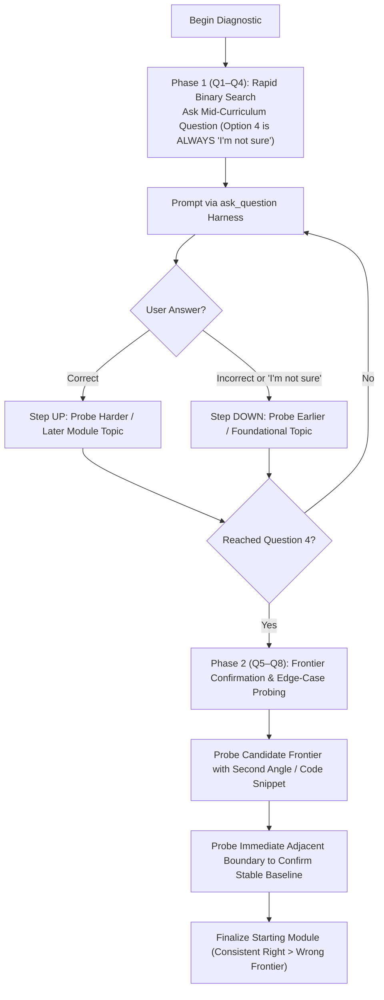
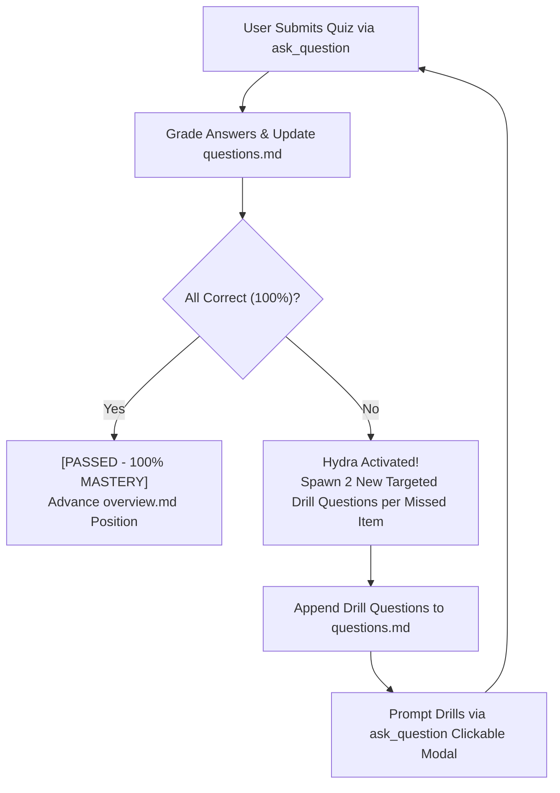

# Notes Conduct Quiz

Use this skill to conduct all learning assessments. Quizzes are written to the target `notes.md` file, delivered interactively in the terminal via the `ask_question` harness tool, and updated in `notes.md` with both the user's answers and detailed explanations.

> [!CAUTION]
> **WORKSPACE PATH ENFORCEMENT (CRITICAL)**:
> All `notes.md` and quiz files MUST be created and edited inside the user's **active project workspace (Current Working Directory)** (e.g., `./notes/` or `./01-.../`).
> **NEVER** write or edit files inside `~/.agents/`, `~/.gemini/`, or inside the skill's own installation path.

---

## 1. The 5 Quiz Types & Sizing

| Quiz Type | Location | Purpose & Trigger | Sizing & Strategy | Format & Harness |
| :--- | :--- | :--- | :--- | :--- |
| **Course Diagnostic** | Root `notes/questions.md` | Calibrates starting point across the whole course roadmap before outlining. | **Adaptive Binary Search with Confirmation (6–8 Questions)**: Starts at moderate difficulty. If correct -> harder/later topic; if wrong / "not sure" -> earlier topic. Confirms frontier to eliminate lucky guesses. | Written to root `questions.md` & prompted via `ask_question` clickable modal. |
| **Module Diagnostic** | `NN-module/questions.md` | Calibrates baseline familiarity within the specific module before lesson authoring. | **Adaptive Binary Search with Confirmation (6–8 Questions)**: Probes prerequisites and core module concepts, confirming baseline with 6–8 total questions. | Written to module `questions.md` & prompted via `ask_question` clickable modal. |
| **Post-Lesson Check-in** | `NN-module/questions.md` | Validates understanding of a single lesson when the user signals "ready". | **6–10 Questions**: Includes dedicated application codeblocks, tradeoff analysis, and common bugs. | Written to `questions.md` with syntax-highlighted codeblocks, simultaneously prompted via `ask_question` clickable modal. |
| **Hydra Remediation Drill** | `NN-module/questions.md` | Triggered if any check-in question is missed. Enforces **100% mastery**. | **2 new targeted drill questions per missed item**. | Appended to `questions.md` and prompted via `ask_question` until 100% is achieved. |
| **Module Re-quiz** | `NN-module/questions.md` | Comprehensive retention and synthesis test across all lessons in the module. | **~20 Fresh Questions**: Brand new scenarios testing integration across the entire module. | Written to `questions.md` & delivered in chunks via `ask_question`. |
| **Course Major Quiz** | Root `notes/questions.md` | Comprehensive capstone evaluation covering all modules in the course. | **35–65 Questions** (Scaled to size: ~35 for 5-lesson courses, up to ~65 for 15+ lesson courses). Fresh real-world problems. | Written to root `questions.md` & chunked via `ask_question`. |

---

## 2. Adaptive Binary Search Diagnostic Algorithm & "I'm Not Sure" Rule

> [!IMPORTANT]
> **MANDATORY 4TH OPTION ON DIAGNOSTIC TESTS**:
> In all diagnostic quizzes (both Course Diagnostic and Module Diagnostic), **Option 4 (Option D) MUST ALWAYS be `"I'm not sure"`**.
> Never force the student to guess. Selecting `"I'm not sure"` signals an honest knowledge boundary and instructs the binary search to step down to earlier/foundational topics.

> [!IMPORTANT]
> **STRICT SIZING: 6 TO 8 QUESTIONS (NEVER TERMINATE AT 3–4)**:
> Pure mathematical binary search can terminate in 3–4 steps, but that is too brittle for learning (one lucky guess skews the baseline). 
> **Every diagnostic test MUST deliver 6 to 8 questions total** using the two-phase protocol:



### The Two-Phase 6–8 Question Protocol

1. **Phase 1: Rapid Binary Search (Questions 1 to 4)**:
   - **Q1 (Midpoint)**: Select a representative, moderate-difficulty question from the middle of the curriculum.
   - **Q2 to Q4 (Adaptive Jumps)**:
     - **If Correct**: Step forward to advanced concepts or later module topics to check reach.
     - **If Incorrect or "I'm not sure"**: Step backward to foundational concepts or earlier module topics.
   - By Question 4, you have identified a *candidate frontier*. **DO NOT STOP HERE.**
2. **Phase 2: Frontier Confirmation & Cross-Verification (Questions 5 to 8)**:
   - **Q5 & Q6 (Corroborating Probes)**: Probe the candidate frontier again from a different perspective (e.g. practical code inspection or failure-case analysis instead of pure recall) to rule out lucky guesses.
   - **Q7 & Q8 (Boundary Verification)**: Test the immediate boundary below or above the frontier to ensure the foundational baseline is truly rock-solid and the identified starting point is precise.
3. **Outcome (Calibrated Starting Point)**:
   - Once all 6 to 8 questions are evaluated, identify the exact boundary where the student consistently gets questions right more times than wrong.
   - That verified frontier becomes the calibrated starting module.

---

## 3. Interactive Protocol: Rich `questions.md` + Clickable Harness

### Dual-Channel Interaction Model

> [!IMPORTANT]
> **SIMULTANEOUS RICH PREVIEW & CLICKABLE UI**:
> 1. **Visual Markdown Preview (`questions.md`)**: The agent formats questions with syntax-highlighted codeblocks (e.g. Node.js snippets, curl commands, JSON packets) and diagrams so they render beautifully in VS Code's Markdown Preview pane.
> 2. **Clickable Input Harness (`ask_question`)**: The agent triggers `ask_question` so the student can **click** Option A, B, C, or D using radio buttons in the UI modal without manual typing.
> 3. **Instant Evaluation**: Upon submission, the agent grades the response and updates `questions.md` with results and explanations.

### A. Post-Lesson Check-In Quizzes (6–10 Questions)

1. **Target File**: Locate or initialize `questions.md` in the active module directory (e.g. `01-module/questions.md`).
2. **Format Rich Questions in `questions.md`**:
   Include dedicated application codeblocks for relevant questions:
   ````markdown
   ### Quiz: Lesson [NN] Check-in ([Lesson Title])
   *Conducted on: YYYY-MM-DD HH:mm*

   #### Q1: [Theory / Concept Question]
   - A) [Option A]
   - B) [Option B]
   - C) [Option C]
   - D) [Option D]

   #### Q2: [Application / Code Inspection]
   Given the following implementation:
   ```javascript
   server.on('upgrade', (req, socket, head) => {
     // ...
   });
   ```
   What must the handler emit if `Sec-WebSocket-Version` is `8`?
   - A) Emit HTTP 400 Bad Request indicating the client version is malformed
   - B) Emit HTTP 426 Upgrade Required requesting Sec-WebSocket-Version 13
   - C) Emit HTTP 101 Switching Protocols and negotiate a legacy handshake
   - D) Emit socket 'error' and terminate the TCP connection immediately
   ````
3. **Prompt via Clickable Modal (`ask_question`)**:
   Prompt the questions in chunks of 3–5 so the student can simply click their choices.
4. **Grade and Update `questions.md`**:
   Append user answers, correct answers, results (`[CORRECT]` / `[INCORRECT]`), and concise technical explanations.

---

### B. The Hydra 100% Mastery Protocol

> [!CAUTION]
> **100% MASTERY REQUIRED TO ADVANCE**:
> A lesson check-in is ONLY passed when the student achieves **100% accuracy**.
> If any question is missed, the **Hydra Rule** activates:
> For **every 1 missed question**, spawn **2 new targeted drill questions** on that specific misconception or topic!



1. **Identify Misconceptions**: For every incorrect answer, diagnose the exact conceptual flaw.
2. **Spawn 2 Drill Questions per Missed Item**:
   - If 1 question missed: generate 2 fresh drill questions.
   - If 2 questions missed: generate 4 fresh drill questions.
3. **Append to `questions.md`**:
   ```markdown
   #### Hydra Remediation Drill: [Topic / Misconception Name]
   *(2 targeted questions spawned to achieve 100% mastery)*

   ##### H1: [Targeted Drill Question 1]
   - A) ...
   - B) ...
   - C) ...
   - D) ...

   ##### H2: [Targeted Drill Question 2 with Code Block]
   ...
   ```
4. **Prompt via `ask_question`**: Deliver the drill questions interactively.
5. **Repeat Until 100%**: Continue until all hydra drill questions are answered correctly.

---

## 4. Special Quiz Rules

1. **Strictly Fresh Questions for Re-quizzes**:
   - The **Module Re-quiz (~20 questions)** and **Course Major Quiz (35–65 questions)** must NEVER reuse earlier quiz questions verbatim.
   - Synthesize fresh scenarios, cross-topic integrations, and edge cases to test durable comprehension and transfer.
2. **Chunking Large Quizzes**:
   - Chunk large quizzes via `ask_question` into manageable sets of 3–5 questions per turn so the student isn't overwhelmed.
   - Progressively write results to `questions.md` after each chunk.
3. **Question Layout & Option Symmetry (Anti-Test-Wiseness Protocol)**:
   - **Option Length Parity**: Keep all option choices (A, B, C, D) balanced in character and word count (within ~15–20% length variance). Never make the correct answer substantially longer or shorter than the distractors.
   - **Avoid Artificially Lengthened Specificity**: Never overload the correct choice with defensive qualifiers, granular mechanics, or hyper-specific parentheticals while leaving distractors curt or superficial. If technical context is required, place the context in the question stem rather than bloating the correct option.
   - **Plausible & Technically Credible Distractors**: Distractors must represent genuine real-world misconceptions, adjacent architectural patterns, or believable edge-case failures. Avoid caricature or obviously fabricated choices (e.g. "CSS styles cached in hardware GPU cache" or "browser C++ DOM tree crashed").
   - **Syntactical & Grammatical Parallelism**: Ensure all options start with the same part of speech (e.g., all active verbs, all noun phrases, or all causal clauses) and share parallel grammatical structure.
   - **Clean Layout**:
     - *Context/Scenario*: Present background context clearly.
     - *Code/Snippet*: If applicable, format cleanly above the question prompt.
     - *Prompt*: Crisp, direct interrogative sentence.
     - *Options*: Formatted cleanly as `- A) ...`, `- B) ...`, etc.

