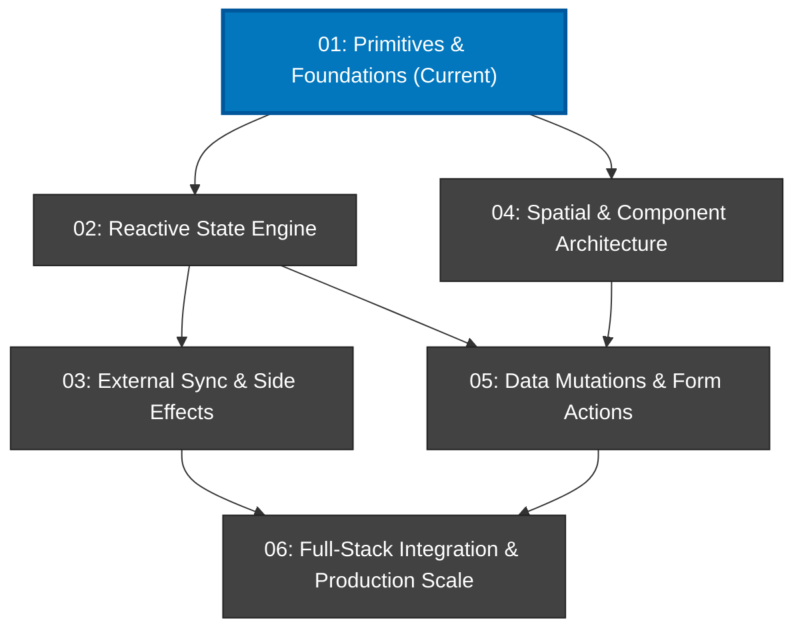
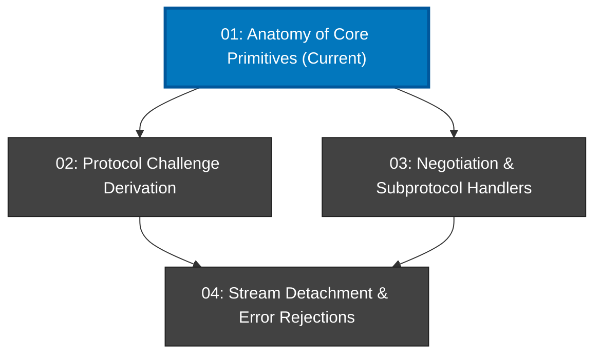

# Notes Create Outline

Use this skill to establish the structure, dependency graphs, and tracking files for an entire course or an individual module.

> [!CAUTION]
> **WORKSPACE PATH ENFORCEMENT (CRITICAL)**:
> All course and module directories (e.g., `./notes/`, `./01-module-name/`) MUST be created inside the user's **active project workspace (Current Working Directory)**.
> **NEVER** create folders or files inside `~/.agents/`, `~/.gemini/`, or inside the skill's own installation directory.

Every learning workspace consists of:
1. `agent_notes.md` (Root Level Only): Contains user preferences, pedagogical settings, the calibrated knowledge frontier, and dynamic learner struggle points and observations. Designed for context-less transfer across different AI agents.
2. `overview.md` (Root & Module Levels): The roadmap containing a high-level summary, a Mermaid dependency graph showing progression and current position, and a numbered breakdown.
3. `questions.md` (Module Level & Root Level): All assessments (diagnostic, check-ins, Hydra drills, re-quizzes) and mid-lesson Q&As.

> [!IMPORTANT]
> **NO `notes.md` IN MODULES (CRITICAL RULE)**:
> Modules do NOT contain a `notes.md` file. All student assessments, check-ins, and Q&As live in `questions.md`. All learning preferences, curriculum settings, and struggle observations are centralized in the top-level `agent_notes.md`.

---

## 1. Graph Topology Rules: True DAGs vs. Anti-Patterns

### Rule A: Ban the "Linked List" Anti-Pattern
Never chain modules or lessons linearly (`A --> B --> C --> D --> E`) unless every single step has an inescapable, direct prerequisite dependency on the immediately preceding one. Sequential linked lists are lazy curriculum design.

### Rule B: Ban the "Starburst" Anti-Pattern
Never create an artificial fan-out and fan-in graph where node 1 points to 4 disconnected leaves, and all 4 blindly converge into the final node without intermediate interactions.

### Rule C: Enforce Authentic Semantic Dependency Pathways (DAGs)
A true Directed Acyclic Graph (DAG) maps real-world dependencies:
1. **Foundations**: Establish shared root primitives.
2. **Parallel Specialized Branches**: Once foundations are met, independent concerns branch into concurrent tracks.
3. **Natural Synthesis Milestones**: Branches cross-pollinate and merge only when an application feature or system integration requires both prerequisites.
4. **Capstone Convergence**: Advanced performance, production hardening, or full-stack integration synthesize the complete graph.

---

## 2. Source Material Authority: PPT / Syllabus Rule

1. **User-Provided Syllabus / Slides / PPTs**:
   - If the user provides lecture slides, presentation outlines, or a curriculum document, the orchestrator **must adhere 100% strictly** to that exact structure.
   - Do not invent artificial re-partitioning, do not collapse modules, and do not split topics unless explicitly instructed.
2. **Scratch Generation**:
   - If generating an outline from a raw topic prompt, calibrate the intended dimension (Breadth Survey vs. Vertical Deep Dive).

---

## 3. Scope Calibration: Breadth vs. Depth & Length Tiers

Module count alone does not dictate depth, but it dictates the scope and pacing of the curriculum:
* **Vertical Deep Dive**: Laser-focused on low-level framework/engine/physics/spec internals, compiler mechanics, threat models/attack surfaces, wire layouts, or kernel socket buffers.
* **Horizontal Breadth Survey**: Broad architectural coverage across paradigms, weapon classes, technologies, trade-offs, and multi-system integration.
* **The Grounding Rule for Deep Dives**: When introducing physiological, cognitive, or low-level engineering topics, they must immediately tie to a tangible in-game or system reality (e.g. why staring at crosshairs causes you to miss heads; why JSON cannot serialize Symbols).

### Post-Diagnostic Course Length Tiers
After the diagnostic test pinpoints the student's frontier, the curriculum length tier determines the module budget:
* **Short (1–3 modules)**: Quick targeted sprint focusing strictly on the immediate frontier and core essentials. Even in a 3-module course, branch independent concepts (e.g. `M01 --> M02 & M03`) rather than defaulting to a linear chain.
* **Average (4–8 modules)**: Standard comprehensive curriculum covering core architecture, practical workflows, and real-world patterns.
* **Long (9+ modules)**: Deep, exhaustive masterclass covering low-level internals, edge cases, security, and production scale.
* **Unforced Natural Sizing**: Within the selected tier, let the natural complexity of the topic determine the exact count (e.g. a 5-module or 7-module course in the Average tier). Never pad with artificial fluff to hit a round number.

---

## 4. Course-Level Files (`agent_notes.md` & `overview.md`)

When creating the root course structure (e.g. in `notes/` or `<output-dir>/`):

### Directory Layout
```
notes/
  agent_notes.md    # User preferences, course settings, knowledge frontier, learner struggle tracker
  overview.md       # Course summary, true DAG module dependency graph, module descriptions
  questions.md      # Course-level diagnostic test and final capstone major quiz
```

### Top-Level `agent_notes.md` Template (Context-Less Transfer)

> [!IMPORTANT]
> **CONTEXT-LESS AGENT HANDOFF**:
> `agent_notes.md` is specifically engineered so that **any new AI agent** brought into the workspace can immediately understand the user's exact preferences, settings, and learning state without needing prior conversation history.
> The agent logs observations here whenever the user struggles with a topic or triggers Hydra remediation drills.

```markdown
# Agent Notes: [Topic / Course Name]

## Learning Preferences & Settings
- **Topic & Concrete Outcome**: [What the user wants to learn and build/achieve]
- **Target Scope & Depth**: [Vertical Deep Dive vs. Horizontal Breadth Survey]
- **Course Length Tier**: [Short (1–3 modules) / Average (4–8 modules) / Long (9+ modules)]
- **Topic Domain**: [Software/Code vs. Practical Craft / Non-Code]
- **Learning Style**: [Project-based vs. Concept-only vs. Mixed]
- **Source Authority**: [Provided Syllabus/PPT vs. Generated from Scratch]
- **Question Delivery Mode**: [Interactive UI Modal (`ask_question`) / Markdown Checkbox (`- [ ]` in `questions.md`)]
- **User Pacing / Notes**: [Any additional nuances or preferences captured during grilling]

## Baseline Knowledge Frontier
- **Diagnostic Result**: [Summary of Phase 1 & 2 diagnostic score, confirmed boundary]
- **Starting Module**: [Calibrated starting module, e.g. 01-primitives-and-foundations/]

## Learner Observations & Struggle Points
*(Dynamic observation log updated whenever the learner misses questions, triggers Hydra drills, or encounters friction)*
- **[Timestamp or Module NN]**: [Specific struggle or misconception observed, e.g., "Struggles with framing layer byte offsets; misidentified masking key position. Resolved via Hydra drill H1-H2."]

## Module Progress Log
- **01-[module-name]**: [Status: In Progress / Passed. Audit notes: Verified by Technical Auditor.]
```

### Course `overview.md` Template (True Branching DAG)
```markdown
# [Course Title]

[A single concise paragraph summarizing what we will tackle across this course, why it matters, and the final capability you will possess.]

## Dependency Graph



**Current Position**: `Primitives & Foundations` (`01-primitives-and-foundations/`) - In Progress

## Modules Breakdown

1. **Primitives & Foundations** (`01-primitives-and-foundations/`) - [1-3 sentences describing the topic, what it tackles, and what it includes.]
2. **Reactive State Engine** (`02-reactive-state-engine/`) - [1-3 sentences describing the topic, what it tackles, and what it includes.]
3. **External Sync & Side Effects** (`03-external-sync-and-side-effects/`) - [1-3 sentences describing the topic, what it tackles, and what it includes.]
4. **Spatial & Component Architecture** (`04-spatial-and-component-architecture/`) - [1-3 sentences describing the topic, what it tackles, and what it includes.]
5. **Data Mutations & Form Actions** (`05-data-mutations-and-form-actions/`) - [1-3 sentences describing the topic, what it tackles, and what it includes.]
6. **Full-Stack Integration & Production Scale** (`06-full-stack-integration-and-production-scale/`) - [1-3 sentences describing the topic, what it tackles, and what it includes.]
```

---

## 5. Module-Level Layout (No Module `notes.md`)

When creating a specific module folder (e.g. `01-module-name/`):

### Directory Layout
```
01-module-name/
  overview.md       # Module roadmap, lesson DAG dependency graph, lesson descriptions
  questions.md      # All Q&A and quizzes: Student doubts, check-ins with codeblocks, Hydra drills, and re-quizzes
  01-descriptive-phrase-topic.md
  02-descriptive-phrase-topic.md
  ...
```

> [!NOTE]
> There is **NO `notes.md` file in the module folder**. All quiz items, Hydra drills, and student Q&A belong in `questions.md`. All preferences, settings, and learner observations are logged in the root `agent_notes.md`.

### Module `overview.md` Template (Branching Lesson DAG)
```markdown
# [Module Name]

[A single concise paragraph explaining the concrete goals of this module, the practical skill you are developing, and how the lessons fit together.]

## Lesson Dependency Graph



**Current Position**: `Anatomy of Core Primitives` (`01-anatomy-of-core-primitives.md`) - Ready to start

## Lessons Breakdown

1. **Anatomy of Core Primitives** (`01-anatomy-of-core-primitives.md`) - [1-3 sentences describing the topic, what it tackles, and what it includes.]
2. **Protocol Challenge Derivation** (`02-protocol-challenge-derivation.md`) - [1-3 sentences describing the topic, what it tackles, and what it includes.]
3. **Negotiation & Subprotocol Handlers** (`03-negotiation-and-subprotocol-handlers.md`) - [1-3 sentences describing the topic, what it tackles, and what it includes.]
4. **Stream Detachment & Error Rejections** (`04-stream-detachment-and-error-rejections.md`) - [1-3 sentences describing the topic, what it tackles, and what it includes.]
```

---

## 6. Rules & Guidelines for Outlines

1. **Human-Readable Diagram Nodes (Strict)**:
   - All Mermaid graph node labels MUST be human-readable Title Case names (e.g. `01: Primitives & Foundations (Current)`).
   - **NEVER** put raw kebab-case filenames (like `01-primitives-and-foundations`) inside the Mermaid graph nodes.
2. **File and Folder Naming Rule**:
   - The actual folder and file names on disk are derived directly from the Title Case node title by:
     - Lowercasing and converting spaces to hyphens (`kebab-case`).
     - Prepending the zero-padded index number (e.g., `01-primitives-and-foundations/` or `01-anatomy-of-core-primitives.md`).
3. **Node Description Format in Breakdowns**:
   - Numbered list item: `1. **Title Case Name** (`NN-kebab-phrase/` or `NN-kebab-phrase.md`) - 1 to 3 sentences describing the topic, what it tackles, and what it includes.`
4. **Updating the Dependency Graph**:
   - As the user completes lessons and modules, update the Mermaid classes in `overview.md`:
     - `:::done` for finished modules/lessons (Green).
     - `:::current` for the active module/lesson (Blue).
     - `:::pending` for upcoming modules/lessons (Grey).
   - Update the **Current Position** text explicitly so the harness and user always know where they are.
