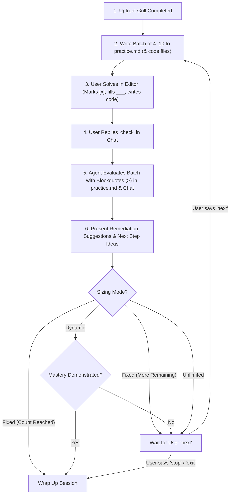

# Notes Practice - Sandbox Practice & Drill Session

Use this skill whenever the user requests on-demand practice questions, targeted drilling, or sandbox experimentation outside of formal milestone evaluations.

Unlike check-in quizzes in `notes-conduct-quiz`, `notes-practice` is a **pure low-risk sandbox**:
- All practice exercises are saved to a dedicated **`practice.md`** file (inside the module directory or root `notes/`).
- **Never logs struggles to `agent_notes.md`** and never halts curriculum advancement.
- Real code-writing exercises are linked to actual runnable code files on disk (with or without starter scaffolding).

---

## 1. Upfront Setup Grill (One Question at a Time)

When invoked via `/notes-practice`, `Practice [topic]`, or during study, do **not** generate questions immediately. Ask each setup question **one at a time** in chat, wait for the user's response, and then proceed:

### Question 1: Scope & Target Material
> *"What topic or module do you want to practice?"*
- **Default**: Current module being studied.
- **Alternative options**: A specific previous module, the entire course so far, or an ad-hoc topic outside the notes (leveraging general programming/domain knowledge).

### Question 2: Question Classification
> *"What type of cognitive practice do you want?"*
1. **Rapid Fire**: Quick definitions, syntax, flags, core terminology, and memory recall (ideal for high-volume drill sessions).
2. **Application**: Practical scenarios — inspecting code snippets, diagnosing subtle bugs, tradeoff evaluations, or writing code in real files.
3. **Deep Architecture & Internals**: Low-level runtime internals, protocol lifecycles, memory boundaries, concurrency, and failure recovery modes.

### Question 3: Question Format
> *"Which format would you like?"*
- **Multiple Choice (MCQ)**: 4-choice questions formatted with `- [ ] A)` checkboxes.
- **Identification**: Direct fill-in questions using the `___` (three underscores) placeholder.
- **Application Tasks** *(available if Application classification is chosen)*: Bug finding, code inspection, tradeoff analysis, and writing code in standalone files.
- **Mixed**: A balanced blend of formats across the batch.

### Question 4: Difficulty Level
> *"What difficulty level do you want to target?"*
- **Easy**: Direct recall, foundational concepts, and standard usage patterns.
- **Average**: Real-world scenarios, common pitfalls, and practical problem-solving.
- **Hard**: Non-obvious edge cases, subtle performance traps, internal engine mechanics, and architectural tradeoffs.

### Question 5: Session Sizing & Progression Mode
> *"How should we pace this practice session?"*
1. **Fixed Count**: Specify a fixed number of questions (e.g. 5, 10, 15). Delivered in batches of 4–10 questions.
2. **Dynamic (Bot Decides)**: The bot continuously monitors your answers and wraps up once you have demonstrated clear, multi-angle mastery across the topic.
   - *Follow-up for Dynamic*: *"Would you like the bot to adaptively increase difficulty between batches as you demonstrate mastery? [y/N]"*
3. **Unlimited (You Decide)**: Keep generating batches of questions until you tell the bot to stop (`stop`, `exit`, `done`).

### Question 6: Custom Requests (Optional)
> *"Any specific areas, frameworks, libraries, or edge cases you'd like to emphasize or avoid?"*

---

## 2. File Persistence & Workspace Organization

> [!CAUTION]
> **WORKSPACE PATH ENFORCEMENT**:
> All practice files MUST be created inside the user's active project workspace (e.g., `./01-module/` or `./notes/`).
> **NEVER** write practice files into `~/.agents/`, `~/.gemini/`, or inside the skill's own installation path.

### Target Locations:
* **Module-Specific Practice**: Target `<module-dir>/practice.md` (e.g. `01-foundations/practice.md`).
* **Cross-Course or Outside Notes**: Target `notes/practice.md` (or `./practice.md` if no notes folder exists).
* **Code-Writing Exercises**: Placed in a dedicated subdirectory alongside `practice.md`:
  ```text
  01-module/
  ├── practice.md
  └── practice-code/
      ├── task-01.js
      └── task-02.py
  ```

---

## 3. Question Formats & Answering Protocol

### A. Multiple Choice Questions (MCQ)
MCQs use markdown checkboxes (`- [ ]`). The user replaces `- [ ]` with `- [x]`.

```markdown
#### P1: [Question Scenario / Interrogative Stem]
- [ ] A) [Option A text]
- [ ] B) [Option B text]
- [ ] C) [Option C text]
- [ ] D) [Option D text]
```

> [!IMPORTANT]
> **MCQ ANTI-BIAS & 25% DISTRIBUTION RULES**:
> 1. **25% Uniform Probability**: The correct answer position MUST be evenly distributed across A, B, C, and D (~25% each). Strictly ban Option A bias.
> 2. **Anti-Clustering**: Never repeat the same correct answer letter more than two questions in a row.
> 3. **Option Length Symmetry**: All options must remain within ~15–20% word length variance. Do not inflate the correct option with hyper-defensive qualifiers.
> 4. **Plausible Distractors**: Distractors must represent genuine real-world misconceptions, not ridiculous caricatures.

### B. Identification Questions
Identification questions use exactly three underscores (`___`) as the blank placeholder. The user edits the file and replaces `___` with their answer text.

```markdown
#### P2: [Identification Stem]
In Node.js streams, the method called to switch a readable stream back into paused mode is: ___
```

> [!NOTE]
> **Semantic Tolerance on Grading**:
> Do not penalize minor spelling slips, casing differences, or acceptable synonyms (e.g. accepting `pause()`, `stream.pause()`, or `.pause`). Evaluate the underlying technical understanding.

### C. Application Tasks & Real-File Code Writing
For code-writing exercises, provide instructions in `practice.md` and link directly to a dedicated file on disk in `practice-code/`:

```markdown
#### P3: [Code Writing Exercise Title]
**Task**: Implement a debounce wrapper function that cancels pending executions if invoked within `waitMs`.
**Target File**: [`practice-code/task-01-debounce.js`](file:///path/to/practice-code/task-01-debounce.js)

*Scaffolding has been provided in the target file. Open the file, write your implementation, and save.*
```

* **Scaffolding Strategy**: Vary the difficulty:
  - *With scaffolding*: Provide function signatures, parameter JSDoc comments, and test assertions.
  - *Without scaffolding (from scratch)*: Provide an empty or minimal file so the learner practices starting from a blank buffer.

---

## 4. Batch Delivery & Interaction Lifecycle

Questions are delivered in batches of **4 to 10** at a time:
* **Hard Questions / Code Writing**: Batches of **4 to 6** items to avoid cognitive overload.
* **Easy / Rapid-Fire**: Batches of **7 to 10** items for fast-paced drilling.



### Answering & Evaluation Protocol:
1. **Delivery**: The agent appends the batch into `practice.md`, creates any required `practice-code/*` files, and prints a summary in chat with clickable file links.
2. **User Solves**: The user works directly in their editor (`practice.md` and code files), saves their changes, and replies **`check`** in chat.
3. **Evaluation**:
   - The agent reads `practice.md` and any modified code files using `view_file`.
   - The agent appends evaluation notes directly beneath each question in `practice.md` (and outputs them in chat) using markdown blockquotes (`> `):
     ```markdown
     > **Evaluation**: `[CORRECT]` (or `[INCORRECT]` / `[PARTIALLY CORRECT]`)
     > - **Your Answer**: `___` / [User Code]
     > - **Target / Expected**: [Expected answer or model implementation]
     > - **Feedback**: [Crisp, dev-to-dev technical takeaway]
     ```
4. **Remediation Suggestions & Prompt Ideas**:
   - At the conclusion of each batch, the agent provides actionable remediation suggestions (e.g. *"You nailed the event loop questions, but watch out for microtask vs macrotask ordering"*).
   - The agent offers directional ideas for the next batch:
     - *"Would you like to drill deeper into microtask edge cases, shift to practical stream piping, or move to the next batch?"*
5. **Next Batch Trigger**:
   - When the user replies **`next`** (or provides custom direction), the agent generates the next batch.
   - If the user replies **`stop`**, **`exit`**, or **`done`**, the session concludes gracefully.

---

## 5. Dynamic Mode Mastery Determination

In **Dynamic Mode**, the agent decides when the session is complete based on authentic conceptual grasp:
1. **Breadth Check**: The user has successfully handled core questions across all primary sub-topics of the selected domain.
2. **Consistency Check**: The user has answered 3–4 consecutive questions or application tasks correctly without conceptual failure.
3. **Adaptive Difficulty (if enabled)**:
   - If user aces an Easy batch $\rightarrow$ next batch steps up to Average.
   - If user aces an Average batch $\rightarrow$ next batch steps up to Hard.
   - If user struggles $\rightarrow$ maintain level and reinforce the specific mechanism.
4. **Conclusion**: Once mastery is demonstrated across the full topic scope, the agent signals completion, summarizes key strengths, and offers closure.

---

## 6. Examples

### Example: `practice.md` File Structure

````markdown
# Practice Session: Node.js Streams & Buffers
*Conducted on: 2026-10-08 | Mode: Unlimited | Classification: Application | Difficulty: Average*

---

## Batch 1 (Questions P1 – P4)

#### P1: Backpressure Mechanism
When a `Writable` stream's buffer exceeds its `highWaterMark`, what does its `.write(chunk)` call return?
- [x] A) `false`, indicating the producer should pause writing until the `'drain'` event fires
- [ ] B) `null`, causing the producer to drop subsequent frames silently
- [ ] C) An `Error` object triggering an unhandled exception
- [ ] D) `true`, but downgrades the write socket to half-duplex

> **Evaluation**: `[CORRECT]`
> - **Your Answer**: A
> - **Explanation**: When internal buffering exceeds `highWaterMark`, `write()` returns `false` to signal backpressure. The producer should pause until the writable stream emits `'drain'`.

#### P2: Transform Stream Contract
In a custom Node.js `Transform` stream, the callback method that must be invoked after processing a chunk inside `_transform(chunk, encoding, callback)` is: `___`

> **Evaluation**: `[CORRECT]`
> - **Your Answer**: `callback()`
> - **Explanation**: Calling `callback(err, data)` tells the stream harness that transformation of the current chunk is complete.

#### P3: Bug Hunt (Memory Leak)
```javascript
const readable = getLargeStream();
readable.on('data', (chunk) => {
  destinationSocket.write(chunk);
});
```
What critical issue exists in this pipeline under slow client networks, and how do you resolve it?
- [x] A) It ignores backpressure because `readable.on('data')` forces flowing mode without respecting `destinationSocket.write()` return value. Fix by using `pipeline()` or `readable.pipe()`.
- [ ] B) The `'data'` event only yields string encodings, corrupting binary audio/video payloads. Fix by passing `{ binary: true }`.
- [ ] C) The `destinationSocket` terminates automatically after receiving 64KB. Fix by setting socket keepAlive.
- [ ] D) Node.js will block the event loop indefinitely on chunk 1. Fix with `setImmediate`.

> **Evaluation**: `[CORRECT]`
> - **Your Answer**: A
> - **Explanation**: Manually listening to `'data'` pumps chunks as fast as memory allows, ignoring whether the destination is ready and potentially exhausting process memory. `stream.pipeline` handles backpressure and error propagation safely.

#### P4: Code Implementation
**Task**: Build a minimal object-mode transform stream that filters out records where `item.active === false`.
**Target File**: [`practice-code/task-04-filter-stream.js`](file:///path/to/practice-code/task-04-filter-stream.js)

> **Evaluation**: `[CORRECT]`
> - **Review**: Clean implementation. You correctly checked `chunk.active` and skipped calling `this.push()` when inactive, while still correctly invoking `callback()` to avoid stalling the stream.

---

### Remediation & Feedback
You demonstrated a solid understanding of Node.js stream backpressure and flow control mechanics.
- **Strength**: Immediate recognition of backpressure leaks with manual `'data'` handlers.
- **Next Step Ideas**:
  - Want to try a batch on custom `_flush()` cleanup edge cases and error handling?
  - Or switch to binary Buffer byte manipulation?
  - Say `next` to continue, or `stop` if you're satisfied!
````
