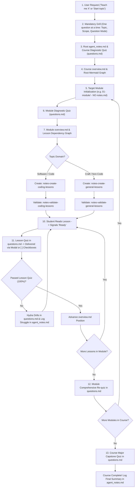

# Notes Start - Interactive Course Orchestrator

This skill coordinates the full learning lifecycle for any technical topic. It orchestrates course design, interactive diagnostic tests, visual dependency graphs, modular lesson generation, dual-subagent validation, and milestone check-in quizzes.

> [!CAUTION]
> **WORKSPACE PATH ENFORCEMENT & STRUCTURE (CRITICAL)**:
> All generated course files (`notes/`, `overview.md`, `agent_notes.md`, `questions.md`, `01-.../`) MUST be created inside the user's **active project workspace (Current Working Directory)**.
> **NEVER** write or create folders inside `~/.agents/`, `~/.gemini/`, or inside the skill's own installation directory.
> **NO `notes.md` IN MODULES**: Modules contain strictly `overview.md`, `questions.md`, and sequenced lesson files (`01-*.md`). Learning preferences, curriculum settings, and dynamic learner struggle points are recorded exclusively in top-level `agent_notes.md`.

---

## Architecture & Sub-Skills Ecosystem

`notes-start` acts as the master orchestrator, delegating focused tasks across 7 specialized skills:

1. **`notes-create-outline`**: Creates and maintains top-level `agent_notes.md` (preferences, settings, struggle tracker), course `overview.md`, and module `overview.md` with true DAG Mermaid graphs.
2. **`notes-conduct-quiz`**: Administers quizzes (diagnostic, mid-lesson check-in, module requiz, course major quiz) via chosen delivery format (clickable UI modal or Markdown checkboxes `- [ ]`), updates `questions.md`, and logs learner struggles to `agent_notes.md`.
3. **`notes-create-coding-lessons`**: Generates sequenced lesson files (`01-...md` to `0n-...md`) for **code and software engineering topics** (runnable snippets, after-code translations, dev-to-dev voice).
4. **`notes-create-general-lessons`**: Generates sequenced lesson files (`01-...md` to `0n-...md`) for **non-code and practical craft topics** (e.g. baking, concrete molding, perfumery, cooking, carpentry) using action protocols, sensory checks, and physical recoveries.
5. **`notes-validate-coding-lessons`**: Audits **code and software engineering topics** (syntax, API versions, RFC specs, and runtime mechanics).
6. **`notes-validate-general-lessons`**: Audits **non-code and practical craft topics** (factual truth of claims, scientific mechanisms, craft realism, and safety without micromanaging numbers).
7. **`notes-ask`**: Answers mid-lesson questions and doubts with punchy, dev-to-dev explanations, zero AI fluff, targeted Mermaid diagrams (sequence/architecture/memory), persists Q&As to `questions.md`, and flags struggle areas in `agent_notes.md`.

---

## Complete End-to-End Workflow

---

## Detailed Step-by-Step Instructions

### Step 1: Mandatory Grill (One Question at a Time)
Do NOT generate course files until the user has been grilled. Ask **one question at a time** in the terminal, wait for the response, and then ask the next:

1. **Topic & Specific Outcome**: "What exact topic do you want to learn, and what concrete project or outcome do you want to achieve with it?"
2. **Source Material Authority**: "Do you have an existing outline, syllabus, or lecture slides/PPT? (If yes, paste or point to them, and I will adhere 100% strictly to your structure without inventing arbitrary divisions)."
3. **Scope Calibration (Breadth vs. Depth)**: "If generating from scratch, what is your target scope?
   - **(A) Horizontal Breadth Survey**: Broad architectural coverage across multiple technologies, paradigms, or weapon/system classes.
   - **(B) Vertical Deep Dive**: Exhaustive low-level spec & internals on this specific topic (runtime engine, wire framing, compiler transforms, kernel buffers, or motor biomechanics).
   *(Note: Module count will be determined naturally based on topic complexity—we never pad with artificial fluff to hit a round number).*
4. **Topic Domain**: Determine if the topic is **Software/Code** (programming, frameworks, devops) or a **Practical Craft / Non-Code** (baking, concrete molding, perfumery, cooking, carpentry). (Auto-detect or confirm with user).
5. **Learning Style**: Project-based (hands-on code or physical recipes/protocols) vs. Concept-only (theory, mental models) vs. Mixed.
6. **Current Level**: Beginner / Intermediate / Advanced.
7. **Output Workspace**: Confirm root directory in current workspace (default: `./notes/` or `./Learning/<topic>/`).
8. **Question Delivery Mode**: "How would you like to take quizzes and check-ins?
   - **(A) Interactive UI Modal (`ask_question`)**: The agent generates clickable buttons in the interface (smooth, zero typing).
   - **(B) Markdown Checkboxes (`- [ ]` in `questions.md`)**: The agent writes questions directly to `questions.md` with `- [ ]` checkboxes; you mark `- [x]` in your editor and reply 'done'. (Saves tokens, keeps everything in markdown)."

> [!IMPORTANT]
> **INITIALIZE `agent_notes.md` IMMEDIATELY AFTER GRILL**:
> Write all captured settings and preferences into the root `agent_notes.md` file. This guarantees that if a new or different agent takes over the session later, it immediately understands all user preferences and settings with zero conversation history.

---

### Step 2: Course-Level Diagnostic Quiz (Adaptive Binary Search with Confirmation: 6–8 Questions)
Once the grill finishes:
1. Create the root folder in the project workspace (e.g., `./notes/`).
2. Invoke `notes-create-outline` to initialize root `notes/agent_notes.md` with all captured preferences.
3. Invoke `notes-conduct-quiz` to run the **Adaptive Binary Search Diagnostic**:
   - **Strict Sizing (6 to 8 questions total)**: NEVER terminate at 3–4 questions.
   - **Phase 1 (Q1 to Q4)**: Binary search jumps to locate the candidate frontier (Step up on correct; step down on incorrect or `"I'm not sure"`).
   - **Phase 2 (Q5 to Q8)**: Corroboration & boundary verification to eliminate lucky guesses and confirm stable baseline.
   - **Crucial Rule**: Every diagnostic question **MUST include Option 4 (Option D) as `"I'm not sure"`**, with Options A, B, and C strictly balanced in length and plausibility.
   - Deliver into root `notes/questions.md` via the learner's chosen mode (Modal or `- [ ]` Checkboxes).
4. Record all questions, user answers, and correct explanations directly in `notes/questions.md`.
5. Record the verified frontier in `notes/agent_notes.md` and designate it as the starting module for the course.

---

### Step 2.5: Course Length Calibration (Post-Diagnostic)
*Why ask here?* Now that the diagnostic test has pinpointed what the student already knows and identified the knowledge frontier, prompt the user via `ask_question` (or chat) to determine course length:
* **Short (1–3 modules)**: Quick targeted sprint focusing strictly on the immediate frontier and core essentials.
* **Average (4–8 modules) (Recommended)**: Standard comprehensive curriculum covering core architecture, practical workflows, and common patterns.
* **Long (9+ modules)**: Deep, exhaustive masterclass covering low-level internals, edge cases, security, and production scale.

Record the selected course length tier in root `notes/agent_notes.md`.
*(Exception: If the user provided an existing syllabus or PPT deck in Step 1, skip this prompt and adhere 100% strictly to the provided syllabus structure).*

---

### Step 3: Course Overview & Dependency Graph
Based on the diagnostic frontier and the selected length tier (Short: 1–3, Average: 4–8, Long: 9+):
1. Invoke `notes-create-outline` to create `notes/overview.md`.
2. **Run Outline Validation Gates**:
   - **DAG Topology Gate**: Reject linear linked lists (`A -> B -> C -> D`) and artificial starbursts. Require authentic semantic dependency pathways with parallel branches and convergence milestones.
   - **Scope Alignment Gate**: Confirm depth/breadth matches user intent without falling into tutorial hell or hyper-pedantic micro-fixations.
   - **Source Fidelity Gate**: If external slides/syllabus were provided, confirm 1:1 structural fidelity.
3. Structure `overview.md` strictly as:
   - `# [Topic Name]`
   - `[Summary paragraph describing the complete journey and end state]`
   - `## Dependency Graph`
   - Mermaid diagram (`graph TD`) mapping all modules (`01-...` to `0n-...`) as a branching/converging DAG with human-readable Title Case labels and status styles (`:::current` on the calibrated starting module, `:::done` on mastered modules, `:::pending` on remaining).
   - Explicit `**Current Position**: Title Case Name (NN-module-name/)` indicator.
   - `## Modules Breakdown` with numbered descriptions (1-3 sentences per module).

---

### Step 4: Module-Level Setup (`01-module/` - No Module `notes.md`)
When initiating a module:
1. Create the module directory inside the project workspace (e.g., `./01-foundations-of-laravel/`).
2. **Do NOT create `notes.md` in the module**: Module files are strictly `overview.md`, `questions.md`, and lesson files.
3. Invoke `notes-conduct-quiz` to run the **Module Diagnostic Quiz** (adaptive binary search within module scope):
   - **Crucial Rule**: Every diagnostic question **MUST include Option 4 (Option D) as `"I'm not sure"`**.
   - Written to `01-.../questions.md` and delivered via chosen mode (Modal or Checkbox).
4. Evaluate user answers, log results in `questions.md`, and record baseline observations in root `agent_notes.md`.
5. Invoke `notes-create-outline` to generate `01-.../overview.md` containing:
   - Module objective summary.
   - Lesson Mermaid dependency graph (`L01["Title Case Phrase (Current)"]:::current --> L02["Title Case Phrase"]:::pending`).
   - Descriptive phrase numbered list (1-3 sentences per lesson).

---

### Step 5: Lesson Generation & Validation (Dynamic Subagent Delegation)

> [!IMPORTANT]
> **ORCHESTRATOR ROLE**:
> The orchestrator does NOT write lesson content or edit lesson prose. It coordinates the workflow by dynamically delegating tasks to specialized subagents:

1. **Delegate Lesson Content Creation (Subagent 1)**:
   - **For Software / Code Topics**: Invoke a subagent (`invoke_subagent`) using **`notes-create-coding-lessons`** (runnable code snippets, after-code translations, dev-to-dev stance).
   - **For Practical Craft / Non-Code Topics** (e.g. baking, concrete molding, perfumery, cooking, carpentry): Invoke a subagent (`invoke_subagent`) using **`notes-create-general-lessons`** (action protocols, sensory checks, broken-case recoveries, artisan-to-apprentice stance).
   - The subagent authors all sequenced lesson files (`01-...md` to `0n-...md`) inside the module directory.
   - **Mandatory Rule for Lesson 01**: Lesson 01 MUST always be the background onboarding lesson that gently eases the student in. It explains what existed before (status quo), why it broke down (pain points), and why this technology or craft was created (the "Why") before introducing any complex syntax or low-level mechanics.
2. **Delegate Technical / Craft Validation (Subagent 2)**:
   - **For Software / Code Topics**: Invoke a single dedicated technical auditor subagent (`invoke_subagent`) using **`notes-validate-coding-lessons`** (checks code syntax, API versions, RFC specs, and runtime mechanics).
   - **For Practical Craft / Non-Code Topics**: Invoke a single dedicated craft auditor subagent (`invoke_subagent`) using **`notes-validate-general-lessons`** (checks factual truth of claims, scientific mechanisms, craft realism, and safety without micromanaging numbers).
   - The auditor auto-patches any technical or factual bugs in the lesson files and reports status.
   - The orchestrator stays hands-off regarding deep content editing.
3. **Notify User**:
   - Once creation and technical audit complete, inform the user in the terminal that the module is ready to begin at Lesson 01.

---

### Step 6: Interactive Lesson Study, `questions.md`, & Hydra Quizzing
For each lesson in the module:
1. **User Study**: The user reads the active lesson (e.g., `01-what-is-laravel.md`).
2. **Mid-Lesson Q&A**: If the student asks any ad-hoc question or clarification, invoke `notes-ask`.
   - `notes-ask` answers in terminal and appends the Q&A and Mermaid diagrams directly into **`questions.md`**.
   - If the student's question indicates a recurring struggle, log it in root `agent_notes.md`.
3. **User Signal**: The user tells the harness in terminal that they are **"ready"** or finished reading.
4. **Trigger Check-in (Per User Preference)**:
   - Inspect `overview.md` to identify the active lesson.
   - Invoke `notes-conduct-quiz` to format a **6–10 question check-in quiz** into **`questions.md`**.
   - If user prefers **Interactive UI Modal**: deliver via `ask_question` in chunks of 3–5.
   - If user prefers **Markdown Checkboxes**: format with `- [ ]` checkboxes in `questions.md`, prompt student to mark `[x]` and reply 'done', then evaluate with `view_file`.
5. **The Hydra 100% Mastery Loop**:
   - Grade answers and update `questions.md` with results and explanations.
   - If score is 100%: Mark as passed and advance `overview.md` (`:::done` on finished lesson, `:::current` on next).
   - If any question is missed:
     - **Log struggle**: Immediately record the diagnosed misconception in root `agent_notes.md` under `## Learner Observations & Struggle Points`.
     - **Activate Hydra**: For every 1 wrong answer, spawn **2 new targeted drill questions** into `questions.md` and deliver via the preferred mode. Quizzing repeats until 100% mastery is achieved.

---

### Step 7: Module Comprehensive Re-quiz & On-Demand Shell Extraction
When the user finishes the last lesson in a module:
1. **On-Demand Question Extraction**:
   - Run the native extraction script to review all covered questions and correct answers across the module's lesson files and `questions.md`:
     - **Windows**: `powershell -ExecutionPolicy Bypass -File .agent/skills/notes-conduct-quiz/scripts/extract-questions.ps1 "<module-dir>"`
     - **Linux/macOS**: `bash .agent/skills/notes-conduct-quiz/scripts/extract-questions.sh "<module-dir>"`
   - The script outputs a reference of all tested concepts in milliseconds with **zero LLM tokens**.
2. **Module Re-quiz (~20 fresh questions)**:
   - Invoke `notes-conduct-quiz` to conduct a comprehensive **Module Re-quiz (~20 fresh questions)** formatted in `questions.md` and delivered via preferred mode in chunks.
   - **Crucial Rule**: Use **brand new questions** testing cross-lesson application and synthesis (never repeat previous quiz items verbatim).
3. **Module Completion**:
   - When passed, mark the entire module as completed (`:::done`) in the root `overview.md`.
   - Update module progress status in root `agent_notes.md`.

---

### Step 8: Course Major Capstone Quiz
Once all modules in the course are completed:
1. Target root `notes/questions.md`.
2. Invoke `notes-conduct-quiz` to generate a comprehensive **Course Major Quiz (35–65 fresh questions)** scaled to course size (~35 for ~5 lesson courses, up to ~65 for 15+ lesson courses).
3. Deliver questions via preferred mode in chunks, record detailed explanations in root `notes/questions.md`, and log final mastery reflections in root `notes/agent_notes.md`.
