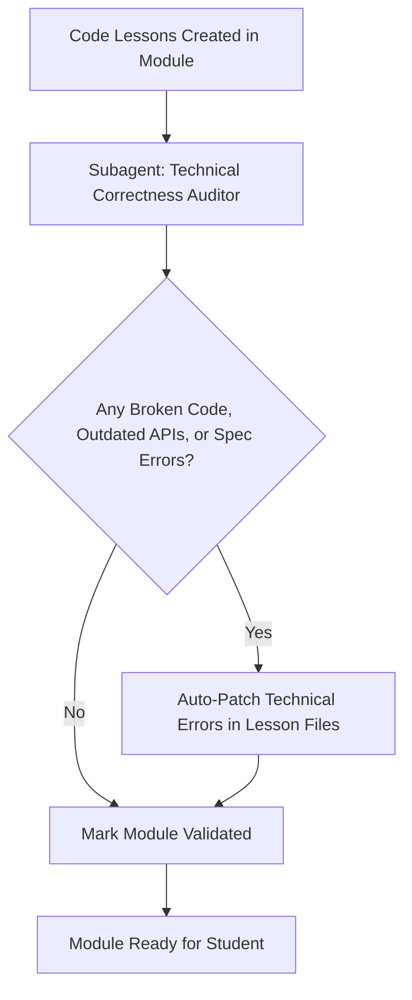

# Notes Validate Coding Lessons

Use this skill to audit and fact-check the code, APIs, and technical explanations in software engineering lesson files within a single module folder. For non-code crafts, use `notes-validate-general-lessons`.

> [!CAUTION]
> **WORKSPACE PATH ENFORCEMENT (CRITICAL)**:
> This skill validates **only the target module** (e.g., `./01-module/`) inside the user's **active project workspace (Current Working Directory)**.
> **NEVER** inspect or edit files inside `~/.agents/` or `~/.gemini/`.

> [!IMPORTANT]
> **MANDATORY DISTINCT SUBAGENT ENFORCEMENT**:
> The technical auditor MUST be a **completely different, freshly invoked subagent instance** from the subagent that authored the lessons.
> **NEVER** reuse the creator subagent to audit its own code. An independent subagent guarantees unbiased syntax verification and prevents confirmation bias.

---

## 1. Single Subagent Verification Workflow



### Technical Correctness Auditor Subagent
- **Role**: `Module Technical Auditor`
- **Scope**: Fact-checks all code blocks, framework APIs, protocol specifications, and terminal commands in the module's lesson markdown files.
- **Checklist**:
  1. **Code Validity**: Are all code snippets syntactically valid in the designated language? Are variables properly scoped and imported?
  2. **API & Version Accuracy**: Do the described methods, configuration parameters, and protocol mechanisms match the designated version (e.g., RFC 6455, Laravel 11, Node 20)?
  3. **Factual Integrity of Mechanisms**: Are architectural claims, lifecycle states, and internal mechanisms factually true to how the technology operates?
  4. **Command & Output Realism**: Do CLI commands and expected terminal/wire outputs match real-world execution?
  5. **Bidirectional Navigation Links**: Does every lesson file have the top back-link (`[← Previous: ...]`) and bottom forward-link (`[Next: ... →]`) with valid relative Markdown links forming a clean `01 <-> 02 <-> 03` chain?

---

## 2. Execution Steps

1. **Locate Target Files**:
   Scan all `.md` lesson files under the target module directory:
   `<module-dir>/01-*.md`, `<module-dir>/02-*.md`, etc. (excluding `overview.md` and `questions.md`).
2. **Invoke Technical Audit**:
   Launch the `Module Technical Auditor` subagent to review the lesson files against the checklist above.
3. **Resolve Technical Inaccuracies**:
   If the auditor identifies broken code, inaccurate claims, or outdated APIs, auto-patch the affected lesson files immediately.
4. **Log Validation Summary**:
   Append a concise verification note into the root `agent_notes.md` under `## Module Progress Log`:
   ```markdown
   - **[NN-module-name]**: Validated by Module Technical Auditor (code snippets, APIs, and protocol specs confirmed). Ready for Lesson 01.
   ```
5. **Notify Orchestrator**:
   Signal to the orchestrator that technical validation is complete so the student can be invited to begin Lesson 01.
