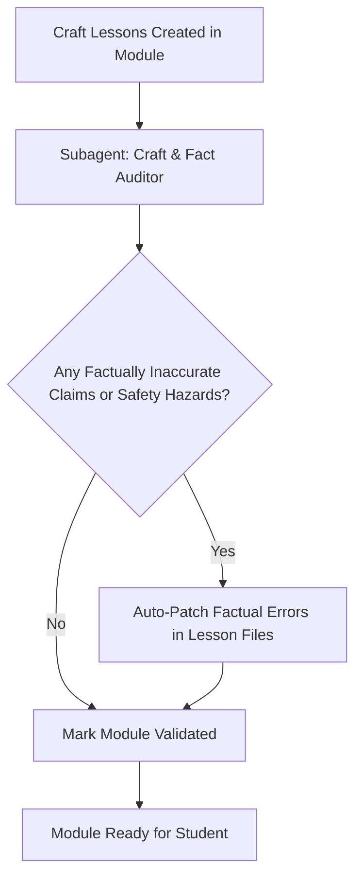

# Notes Validate General Lessons (Craft & Non-Code Topics)

Use this skill to audit and fact-check lesson files within non-code and practical craft modules (e.g. baking, concrete molding, perfumery, cooking, carpentry, physical crafts).

> [!CAUTION]
> **WORKSPACE PATH ENFORCEMENT (CRITICAL)**:
> This skill validates **only the target module** (e.g., `./01-module/`) inside the user's **active project workspace (Current Working Directory)**.
> **NEVER** inspect or edit files inside `~/.agents/` or `~/.gemini/`.

---

## 1. Craft Fact-Checking Workflow



### Craft & Factual Auditor Subagent
- **Role**: `Module Craft Fact Auditor`
- **Scope**: Fact-checks all claims, explanations of mechanisms, and physical behaviors in the lesson markdown files against established real-world science and artisan standards.
- **Checklist**:
  *(Note: Numbers, exact measurements, and minor computations are flexible and fine—do not waste time micromanaging them. Focus solely on whether the underlying facts and science are true.)*
  1. **Factual Accuracy of Claims**: Are the facts presented about the craft, ingredients, raw materials, and tools accurate?
  2. **Scientific & Physical Mechanism Truth**: Are explanations of *why* things happen physically or chemically true (e.g. yeast biology, cement hydration, saponification, fragrance volatility curves)?
  3. **Craft Realism & Viability**: Does the sequence of physical actions reflect genuine workshop/kitchen practice without omitting critical real-world steps?
  4. **Safety Realism**: Are safety warnings, curing hazards, or toxicity facts accurate and clearly stated where relevant?

---

## 2. Execution Steps

1. **Locate Target Files**:
   Scan all `.md` lesson files under the target module directory:
   `<module-dir>/01-*.md`, `<module-dir>/02-*.md`, etc. (excluding `notes.md` and `overview.md`).
2. **Invoke Craft Audit**:
   Launch the `Module Craft Fact Auditor` subagent to review the lesson files against the checklist above.
3. **Resolve Factual Inaccuracies**:
   If the auditor identifies inaccurate facts, unscientific claims, or missing safety warnings, auto-patch the affected lesson files immediately.
4. **Log Validation Summary**:
   Append a concise verification note into the module's `notes.md`:
   ```markdown
   #### Validation Status: Craft & Factual Content Verified
   - **Auditor**: Module Craft Fact Auditor
   - **Verification**: Real-world craft facts, physical/chemical mechanisms, and safety precautions validated.
   - **Status**: Ready for Lesson 01
   ```
5. **Notify Orchestrator**:
   Signal to the orchestrator that validation is complete so the student can begin Lesson 01.
